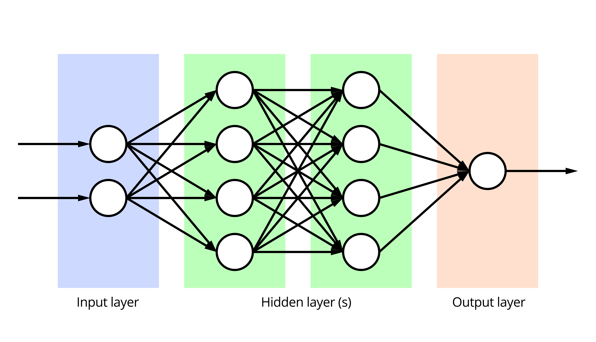
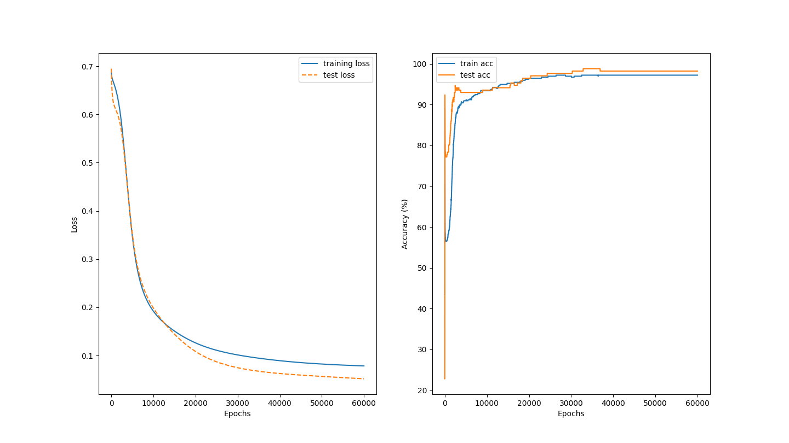

# Multilayer perceptron

This project is an introduction to artificial neural networks, with the
implementation of a multilayer perceptron from scratch.

## Introduction

A Neural network in deep learning can be represented like this:



The input layer is our input layer  
The hiddens layers are where the magic append! Each neurons do a calculation with it own Weights and layer bias, then all neurons send the result to the neurons in the next layer
And finally the output layer is the model prediction! In our case we got a simple classifier so 2 neurons in output (true or false to whether a cancer is malignant or benign )

## Requirements

- [Poetry](https://python-poetry.org/)
- python ^3.10

## Installation

First run ```bash
poetry install

````

then ```bash
$(poetry env activate)
````

to enter the virtual env

## How to use

This project is a artificial neural network from scratch, i use a dataset
of breast cancer to train my network!

The project is separate in three scripts:

- separate
- train
- predict

### Separate

Separate is the first script to run, it's gonna split the datasets (70% for training and 30% for predict by default)

You can use it like this:

```bash
python multilayer_perceptron/separate.py datasets/data.csv
```

You should now have 2 new files in the dataset folder:

- datasets/data_train.csv
- datasets/data_test.csv

### Train

The train script is like you will guess, the script to create and train the neural network.  
you can configure the neural network like you want (how much hidden layer how much neurons etc...)

Exemple:

```bash
python3 multilayer_perceptron/train.py datasets/data_train.csv datasets/data_test.csv --epochs 1000 --learning_rate 0.01 --layer 3
```

or just run it with default parameters like this:

```bash
python3 multilayer_perceptron/train.py datasets/data_train.csv datasets/data_test.csv
```

the model should be saved in a: model.npy file, and you should see a training monitoring graph like this:



### predict

Ok now we got a neural network trained and ready to predict whether a cancer is malignant or benign

Lets run it like this:

```bash
python3 multilayer_perceptron/predict.py  model.npy datasets/data_test.csv
```

And you should see something like this:

```bash
ACCURRACY: 98.24561403508771
LOSS (Binary cross entropy): 0.051835907854789455
```

Nice we go a prettry accurate model! :)
